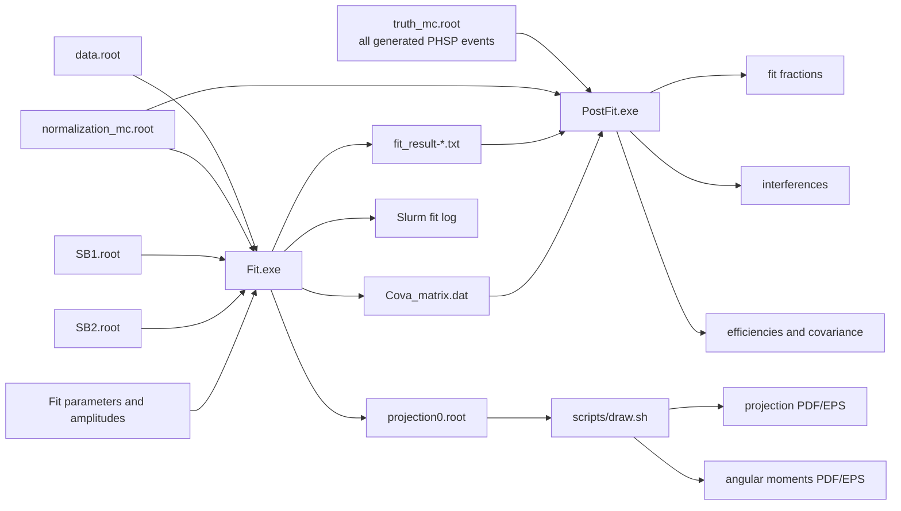

# GVV v1 Amplitude Analysis

Release candidate: `gVV v1.0.0-rc1`. See [CHANGELOG.md](CHANGELOG.md) for the
normalization and validation history.

GPU-accelerated partial-wave analysis of
`psi(2S) -> gamma omega omega`, with
`omega -> pi+ pi- pi0`.

This directory is the normalized `gVV_v1` analysis copy. It contains the active
physics implementation, CUDA build, Slurm entry points, post-fit tools, ROOT
plotting macros, tests, and reproducibility documentation. The normalization
work changes the project layout and entry points only; it does not change the
current event selection, amplitude definitions, or fit conventions.

The amplitude content is now selected at runtime from the directly edited
`nominal/config/model.json`; Resonance/Term counts and the Minuit layout are not
compiled-in nominal constants. See
[`MODEL_CONFIGURATION.md`](nominal/docs/MODEL_CONFIGURATION.md) before adding or
removing a component.

> **Scope:** this README documents the active v1 implementation under
> `nominal/`. Historical gKK/K-matrix utilities are intentionally excluded from
> this release and are not part of the build, fit, PostFit, or plotting paths.

## Contents

- [Physics goal and physical picture](#physics-goal-and-physical-picture)
- [End-to-end workflow](#end-to-end-workflow)
- [Requirements and project environment](#requirements-and-project-environment)
- [Quick start](#quick-start)
- [Input ROOT contract](#input-root-contract)
- [Repository layout](#repository-layout)
- [Software architecture](#software-architecture)
- [Amplitude and dynamics model](#amplitude-and-dynamics-model)
- [Likelihood and background treatment](#likelihood-and-background-treatment)
- [Fit stage](#fit-stage)
- [PostFit stage](#postfit-stage)
- [Projection and angular-moment plots](#projection-and-angular-moment-plots)
- [Tests and validation](#tests-and-validation)
- [Reproducibility and troubleshooting](#reproducibility-and-troubleshooting)

## Physics goal and physical picture

The analysis studies the radiative decay chain

$$
\psi(2S) \to \gamma X, \qquad X \to \omega\omega,
\qquad \omega \to \pi^+\pi^-\pi^0.
$$

The two omega candidates are reconstructed from the selected three-pion
combinations in the input event. The current event representation contains one
ordered omega-1 candidate, one ordered omega-2 candidate, and the bachelor
photon; it does not add an additional coherent sum over alternative three-pion
pairings.

The physics model separates three ideas that are evaluated in different code
layers:

1. **Decay geometry:** Lorentz vectors, epsilon tensors, orbital tensors, and
   omega decay currents describe the event-by-event angular structure.
2. **Line shapes:** rho, omega, and X propagators provide complex mass-dependent
   factors.
3. **Production couplings:** complex coefficients are fitted coherently across
   all resonance terms in the same quantum-number sector.

For every event the code constructs a polarization-summed coherent intensity,
not an incoherent sum of independent fit components. The normalization MC and
the final truth-MC calculation use the same amplitude implementation.

## End-to-end workflow



The fitted likelihood uses data, selected normalization MC, and two weighted
sideband samples. `truth_mc.root` is deliberately absent from `Fit.exe`; it is
only required by the independent `PostFit.exe` calculation.

## Requirements and project environment

The project assumes a BESIII/IHEP login and Slurm GPU environment with:

- CUDA toolkit and `nvcc`;
- ROOT with `TTree`, `TMinuit`, and the ROOT command-line executable;
- a C++17-capable compiler through `nvcc`;
- one A100 GPU for the production Fit/PostFit jobs;
- writable project storage for `results/` and `runlog/`.

From the release root, enter the active analysis directory and load its local
environment:

```bash
cd nominal
source config/gvv_env.sh
```

It exports the project root, CUDA path, ROOT path, `ROOTSYS`, `NVCC`,
`ROOT_PREFIX`, and the default external input directory. It also prints the
ROOT and CUDA versions. The current configuration records `/usr/local/cuda-12`
and ROOT 6.32.02; the exact compiler version is the one reported by
`nvcc --version` in the terminal or Slurm log.

The global `setup_ctpwa` function is not modified by this project. A worker
script sources `config/gvv_env.sh` again, so the batch environment is explicit
even when the submission shell had a different module state.

The default input directory is:

```text
../RootSet/
```

Override it when needed:

```bash
export GVV_DATA_DIR=/path/to/RootSet
source config/gvv_env.sh
```

## Quick start

From the release root:

```bash
cd nominal
source config/gvv_env.sh
make -j4
make tests -j4
```

Run the local algebra and model tests:

```bash
./tests/bin/test_dynamics.exe
./tests/bin/test_gvv_amplitude.exe
./tests/bin/test_gvv_model.exe
./tests/bin/test_gvv_fit_parameters.exe
./tests/bin/test_model_definition.exe
./tests/bin/test_gvv_process_model.exe
./tests/bin/test_likelihood.exe
./bin/PostFit.exe --self-test
```

After a fit result exists, the parameter-layout test may additionally validate
that concrete file:

```bash
./tests/bin/test_gvv_fit_parameters.exe results/fit_result-initial.txt
```

Submit the default ten-start fit from `nominal/`:

```bash
./scripts/Sub.sh
```

The script resolves its own location, explicitly exports the project root to
Slurm, and sets the batch working directory to `nominal/`. It can equivalently
be called as `./Sub.sh` after changing to `scripts/`.

To choose a different number of starts or seed:

```bash
./scripts/Sub.sh 20 20260815
```

The two arguments are `n_starts` and `base_seed`. The defaults are ten starts
and seed `20260815`.

## Input ROOT contract

The current input contract is defined in `src/Fit.cu` and shared by the sample
and post-fit code:

| Item | Required value |
|---|---|
| TTree | `Pwa` |
| Four-vector branches | `p4_pip1`, `p4_pim1`, `p4_pi01`, `p4_pip2`, `p4_pim2`, `p4_pi02`, `p4_gam` |
| Branch type | `Double_t[4]` |
| Component order | `(px, py, pz, E)` |

The seven branches represent the two selected three-pion omega candidates and
the bachelor photon. If a future production changes the tree or branch names,
update the `GVVBranchConfig` mapping in the C++ input layer and the tests; do
not rename branches inside the shell scripts.

The four input samples have distinct roles:

- `data.root`: selected data events used in the likelihood;
- `normalization_mc.root`: selected PHSP MC used for the normalization integral;
- `SB1.root`: sideband sample with likelihood coefficient `-0.5`;
- `SB2.root`: sideband sample with likelihood coefficient `+0.25`;
- `truth_mc.root`: the complete generated PHSP sample corresponding to the
  selected normalization MC; used only by PostFit.

The truth and selected normalization samples must come from the same PHSP
production. The truth sample contains all generated events, while the selected
normalization sample contains the events after the same selection used for data.

## Repository layout

```text
gVV_v1/
├── README.md             # release-level architecture and usage guide
├── VERSION               # release-candidate version marker
├── RootSet/              # Fit inputs; truth_mc.root is added when available
└── nominal/              # active analysis variant and runtime root
    ├── bin/              # Fit.exe and PostFit.exe
    ├── build/obj/        # CUDA/C++ intermediate objects
    ├── config/           # runtime model JSON/schema and CUDA/ROOT/data config
    ├── docs/             # build guide and detailed architecture HTML
    ├── include/          # active headers and physics interfaces
    ├── results/          # fit/PostFit/projection numerical outputs
    │   └── plot/         # generated projection and angular-moment figures
    ├── runlog/           # Slurm and optional build logs
    ├── scripts/          # executable shell entry points
    │   └── plot/         # five ROOT/C++ plotting macros
    ├── src/              # Fit, PostFit, and CUDA implementations
    ├── tests/            # test sources, fixtures, and tests/bin executables
    └── Makefile
```

The root-level compatibility symlinks have been removed. The canonical shell
entry points are now the real files under `scripts/`:

```text
scripts/Sub.sh
scripts/subgpu.sh
scripts/Sub_postfit.sh
scripts/subpostgpu.sh
scripts/draw.sh
```

## Software architecture

### Input and event samples

- `include/GVVSample.h` and `src/GVVSample.cu` load ROOT four-vectors into host
  and device buffers.
- `include/NLL_estimator.h` and `src/NLL_estimator.cu` own sample loading,
  GVV intensity orchestration, sideband samples, and projection output.
- `include/framework/Likelihood.h` owns process-neutral MC normalization, PDF
  validation, and signed sample likelihood contributions.
- The same `GVVBranchConfig` convention is used by data, selected MC, sidebands,
  and truth MC, while the fit and post-fit stages remain separate executables.

### Kinematics and dynamics

- `include/Dynamics.h` contains the common two-body momentum `Q`,
  Blatt-Weisskopf factors, fixed-width BW, running-width BWR, Flatte, and
  scalar S/D width helpers.
- `include/Omega.h` constructs the omega decay current and separates its real
  geometric four-vector from the complex rho-isobar factor.
- `include/OmegaPropagator.h` and `src/OmegaPropagator.cu` build and upload the
  omega running-width table used by the event propagator layer.
- `config/model.json` is the single user-edited Resonance/Term model.
  `framework/ModelDefinition` validates generic fields, and
  `process/GVVProcessModel` registers GVV propagators, Waves, and Term dynamics
  before compiling stable ids to a dense runtime device layout.
- `include/GVVModel.h` contains only device representations and propagator
  dispatch; it contains no nominal Resonance or Term list.

### Tensors and amplitudes

- `include/Tensor.h` implements Lorentz tensors, metric contractions, epsilon
  tensors, transverse projections, and orbital tensors.
- `include/GVVAmplitude.h` builds the three registered GVV basis tensors and
  photon polarization projector. The model selects a compact active subset;
  `src/kernel.cu` builds process Term coefficients and performs the generic
  runtime-sized coherent contraction.
- `include/GVVFitParameters.h` and `src/GVVFitParameters.cu` define one shared
  parameter ordering for Minuit, fit-result text, covariance matrices, and
  PostFit error propagation.

### Executables and scripts

- `src/Fit.cu` / `bin/Fit.exe`: multi-start likelihood fit and best-fit
  projection production.
- `src/PostFit.cu` / `bin/PostFit.exe`: truth-MC integration, fit fractions,
  interference, efficiency, and covariance propagation.
- `scripts/Sub.sh`: submits `scripts/subgpu.sh` for Fit.
- `scripts/Sub_postfit.sh`: submits `scripts/subpostgpu.sh` for PostFit.
- `scripts/draw.sh`: calls the five ROOT macros under `scripts/plot/` and writes
  figures under `results/plot/`.
- `Makefile`: builds production binaries under `bin/`, objects under
  `build/obj/`, and tests under `tests/bin/`.

## Amplitude and dynamics model

### Omega decay current

For an omega with pion convention `p0 = pi0`, `p1 = pi+`, and `p2 = pi-`,
`include/Omega.h` implements

$$
\Omega^\mu =
\epsilon^{\mu}{}_{\nu\lambda\sigma}
p_1^\nu p_2^\lambda p_0^\sigma
\sum_{(ab,c)}
B_1(Q_{\omega\rho c})\,BW_\rho(s_{ab})\,B_1(Q_{\rho ab}).
$$

The three terms correspond to the three possible rho pairings. The rho
propagator is a running-width BWR. The code stores the real geometric current
and the common complex rho factor separately so that the same omega dynamics is
reused by every production wave.

### Orbital tensors and basis waves

The X decay orbital tensors are built from the relative omega momentum and the
X four-momentum:

- `t^(1)_delta` is the transverse P-wave vector multiplied by `B_1(Q_Xomegaomega)`;
- `t^(2)_alpha beta` is the symmetric traceless D-wave tensor multiplied by
  `B_2(Q_Xomegaomega)`.

The active basis tensors are:

#### Scalar `0++`, `00`

$$
U_{00}^{\mu\nu} = g^{\mu\nu}
\left(\Omega_1^\alpha\Omega_{2\alpha}\right).
$$

#### Scalar `0++`, `22`

$$
U_{22}^{\mu\nu} = g^{\mu\nu}
t^{(2)}_{\alpha\beta}\Omega_1^\alpha\Omega_2^\beta.
$$

The current default resonance list uses the `00` term for `f0(1500)` and
`f0(1710)`; no `22` resonance term is currently enabled for these states.

#### Pseudoscalar `0-+`, `11`

$$
U_{11}^{\mu\nu} =
\epsilon^{\mu\nu\rho\sigma}p^{(\psi)}_\rho p^{(\gamma)}_\sigma
B_1(Q_{\psi\gamma X})
\;\epsilon^{\delta\lambda}{}_{\alpha\beta}K_\lambda
\Omega_1^\alpha\Omega_2^\beta t^{(1)}_\delta.
$$

The `B_1` factors are part of the corresponding orbital tensors and are not
multiplied a second time in the downstream contraction code.

### Coherent intensity

Each resonance term contributes a complex coupling, an X line shape, and the
common omega factors. `gvv_F_contract` first constructs the real kinematic
bilinear

$$
F_{ab} = \sum_{\text{physical polarizations}}
U_a\,U_b^*,
$$

including the photon projector and the transverse psi polarization sum. The
event intensity is then evaluated as

$$
I(\Phi) = \sum_{i,j}
\left[\Lambda_i f_{X,i}(K^2) f_{\omega1}(k_1^2) f_{\omega2}(k_2^2)\right]
\left[\Lambda_j f_{X,j}(K^2) f_{\omega1}(k_1^2) f_{\omega2}(k_2^2)\right]^*
F_{w_i w_j}(\Phi).
$$

This is the implementation of the polarization-summed `|A|^2`; it is not a
sum of separately squared resonance amplitudes.

### Current resonance content

`config/model.json` defines the active terms:

| Term | Quantum-number basis | Propagator and current role |
|---|---|---|
| `f0_1500_00` | scalar `00` | subtracted effective Flatte; pure S wave |
| `f0_1710_00` | scalar `00` | scalar S-wave BWR; D wave disabled |
| `eta_1760_11` | pseudoscalar `11` | P-wave BWR |
| `eta_c_11` | pseudoscalar `11` | P-wave BWR |
| `X_1835_11` | pseudoscalar `11` | P-wave BWR |
| `X_2370_11` | pseudoscalar `11` | P-wave BWR |
| `NR_0mp_11` | pseudoscalar `11` | nonresonant phase-space term |

The resonance masses and pole widths are fixed at the configured PDG central
values. Complex couplings are fitted subject to the identifiability convention:
the `eta(1760)` coefficient fixes the overall scale and phase, while the
`f0(1710)` scalar reference removes the remaining scalar-sector common phase.
The f0(1500) Flatte ratio is controlled by the `fixed`, `transform`, `step`, and
`bounds` fields of `omegaomega_ratio` in `model.json`.

## Likelihood and background treatment

The background treatment is sample-based rather than an additional background
amplitude. The likelihood combines:

$$
\mathcal{L}_{\mathrm{effective}}
\sim \mathcal{L}_{\mathrm{data}}
 - 0.5\,\mathcal{L}_{\mathrm{SB1}}
 + 0.25\,\mathcal{L}_{\mathrm{SB2}}.
$$

No polynomial or other explicit background function is added to the amplitude
model. Sideband events are evaluated with the same signal PDF and enter the NLL
with fixed coefficients `-0.5` and `+0.25`.

The normalization MC supplies the selected phase-space integral used to
normalize the signal PDF. It is not a fit component with a free yield.

## Fit stage

### Submission

From the project root:

```bash
./scripts/Sub.sh
```

Or from the scripts directory:

```bash
cd scripts
./Sub.sh
```

The wrapper passes the following default files from `GVV_DATA_DIR`:

```text
data.root
normalization_mc.root
SB1.root
SB2.root
```

The wrapper exports `GVV_PROJECT_ROOT` and passes `--chdir=nominal` to Slurm;
the spooled worker therefore never infers the project path from
`/var/spool/.../slurm_script`. The worker requests one A100 GPU and runs
`bin/Fit.exe`. Its command-line form is:

```text
Fit.exe data.root normalization_mc.root SB1.root SB2.root \
        [fit_result.txt [n_starts [base_seed [model.json]]]]
```

For `n_starts > 1`, start 0 uses the nominal parameter point and later starts
randomize only free coupling magnitudes/phases. The log contains the status and
NLL of every attempt. Only the best accepted start writes the final result,
covariance, and projection files.

`scripts/Sub.sh` accepts the same model choice as its third argument:

```bash
./scripts/Sub.sh 20 20260815 config/models/candidate.json
```

Every successful Fit writes the exact canonical model to
`<fit_result>.model.json` for PostFit provenance.

### Fit outputs

- `results/fit_result-*.txt`: machine-readable parameter rows, resonance/term
  metadata, and the multi-start summary;
- `results/Cova_matrix.dat`: covariance matrix for the selected best solution;
- `results/projection0.root`: best-fit projection input for the plotting tools;
- `runlog/gpujob-<jobid>.out`: environment, fit progress, and final status.

## PostFit stage

PostFit is intentionally independent of the likelihood fit. It reads the best
fit parameter file and covariance matrix, evaluates the coherent model on:

1. the complete generated truth PHSP sample; and
2. the selected normalization-MC sample.

The comparison produces fit fractions, pairwise interference fractions, total
and component efficiencies, scalar/pseudoscalar group efficiencies, and finite-
difference covariance propagation. Closure checks ensure that the fractions sum
to one and that the group decomposition reproduces the total integral.

Submit it from `nominal/` after truth MC is available:

```bash
./scripts/Sub_postfit.sh \
  "$GVV_DATA_DIR/truth_mc.root" \
  "$GVV_DATA_DIR/normalization_mc.root"
```

The underlying executable accepts:

```text
PostFit.exe fit_result.txt Cova_matrix.dat truth_mc.root \
           normalization_mc.root [output_prefix [model.json]]
```

With the default prefix `results/postfit_result`, the outputs are:

- `results/postfit_result.txt`;
- `results/postfit_result.root`;
- `results/fit_fractions.tex`.

Use `bin/PostFit.exe --self-test` to test the algebraic closure and
truth-equals-selected efficiency limit without any ROOT input files.

## Projection and angular-moment plots

The shell driver is `scripts/draw.sh`; the ROOT macros are grouped under
`scripts/plot/`:

```bash
./scripts/draw.sh results/projection0.root
```

Without an argument, the driver uses `results/projection0.root`. It runs:

| Macro | Purpose |
|---|---|
| `Draw_projection_2_3.cxx` | main six-variable projection set |
| `Draw_projection.cxx` | detailed projections including the three-pion mass |
| `Draw_projection_components.cxx` | separate resonance/component curves |
| `draw_angular_moments.cxx` | angular-moment distributions |
| `draw_angular_moments_odd.cxx` | odd-moment diagnostic plots |

The driver writes PDF and EPS files under `results/plot/`. It never refits the
data and does not modify `results/projection0.root`.

## Tests and validation

Build and run the unit tests:

```bash
make tests -j4
./tests/bin/test_dynamics.exe
./tests/bin/test_gvv_amplitude.exe
./tests/bin/test_gvv_model.exe
./tests/bin/test_gvv_fit_parameters.exe
./tests/bin/test_model_definition.exe
./tests/bin/test_gvv_process_model.exe
./tests/bin/test_likelihood.exe
./bin/PostFit.exe --self-test
```

`tests/` is the project test area: its C++/CUDA files are unit/regression test
sources, the two text fixtures exercise old/new fit-result parsing, and
`tests/bin/` is generated by `make tests`. Supplying a real fit result to
`test_gvv_fit_parameters.exe` is optional and should only be done after Fit has
produced that file.

Check all shell entry points after a script change:

```bash
bash -n scripts/Sub.sh scripts/subgpu.sh scripts/Sub_postfit.sh \
  scripts/subpostgpu.sh scripts/draw.sh
```

The standard release validation is:

```bash
make clean
make -j4 2>&1 | tee runlog/build.log
make tests -j4 2>&1 | tee runlog/build-tests.log
bash -n scripts/*.sh config/gvv_env.sh
```

## Reproducibility and troubleshooting

### Reproducibility rules

1. Record the fit job ID, input paths, `n_starts`, and `base_seed`.
2. Preserve `fit_result-*.txt`, `Cova_matrix.dat`, `projection0.root`, and the
   corresponding Slurm log as one result set.
3. Keep truth MC and selected normalization MC from the same PHSP production.
4. Do not overwrite a physics result without first copying it to a named backup.
5. For an existing registered Wave/propagator, change only `model.json` and
   tests/notes for that physics hypothesis. Register new propagator physics in
   `Dynamics.h`/`GVVProcessModel.cu`; register a new GVV Wave in
   `GVVAmplitude.h`/`GVVProcessModel.cu`.

### Common checks

- **ROOT/CUDA not found:** source `config/gvv_env.sh` and inspect the printed
  `ROOT`, `nvcc`, and `GVV_DATA_DIR` values.
- **Input file missing:** verify the four Fit files under `$GVV_DATA_DIR` and
  the `Pwa`/branch contract above.
- **No fit output:** inspect the beginning and end of
  `runlog/gpujob-<jobid>.out`; a Slurm `COMPLETED` state alone does not prove
  that the application converged.
- **PostFit input error:** confirm that truth MC is the all-generated sample and
  that normalization MC is its selected subset.
- **Plotting error:** run `source config/gvv_env.sh` and execute
  `scripts/draw.sh` from either `nominal/` via `./scripts/draw.sh` or from the
  `scripts/` directory via `./draw.sh`.

For the build details and command reference, see
[`nominal/docs/BUILD.md`](nominal/docs/BUILD.md). The source-level architecture
and model editing contracts are in
[`nominal/docs/ARCHITECTURE.md`](nominal/docs/ARCHITECTURE.md) and
[`nominal/docs/MODEL_CONFIGURATION.md`](nominal/docs/MODEL_CONFIGURATION.md).
The original detailed physics-to-code map is in
[`nominal/docs/gvv_project_architecture_guide.html`](nominal/docs/gvv_project_architecture_guide.html).
The checks performed for this release candidate are recorded in
[`nominal/docs/RELEASE_VALIDATION.md`](nominal/docs/RELEASE_VALIDATION.md).
